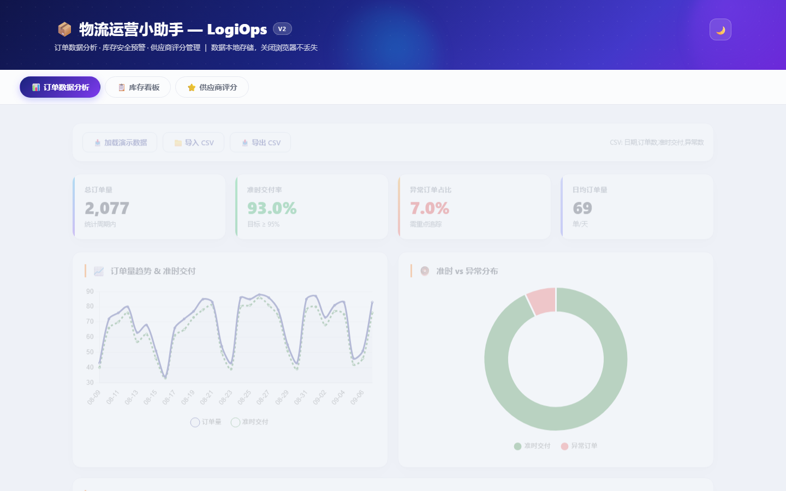
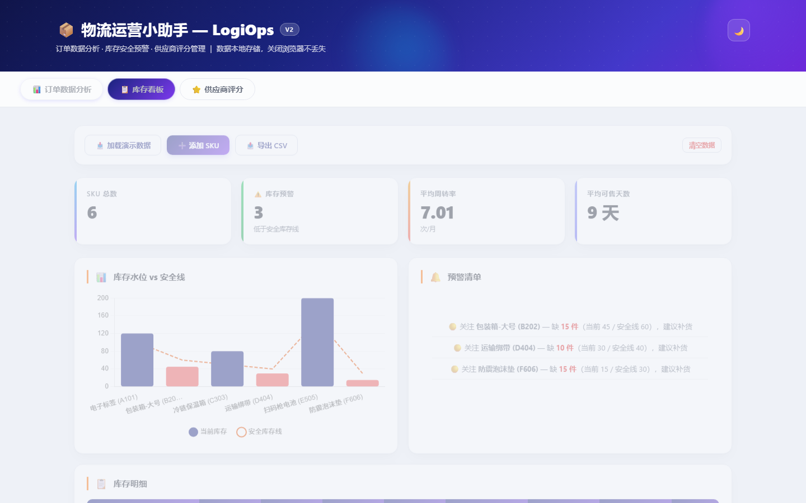
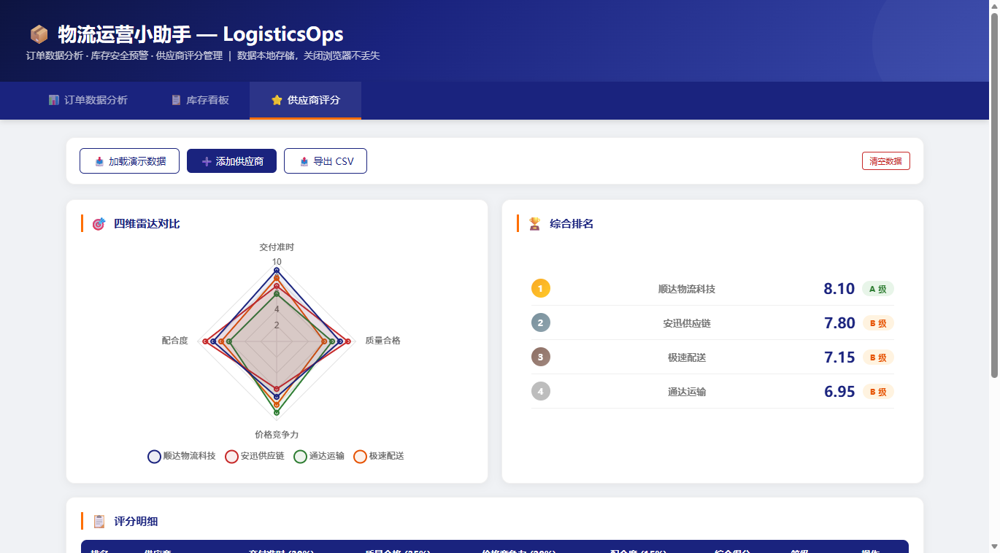

# 📦 物流运营小助手 — LogisticsOps

<p align="center">
  <b>订单数据分析 · 库存安全预警 · 供应商评分管理</b><br>
  物流管理专业实战工具，数据本地存储，开箱即用
</p>

<p align="center">
  
  
  
  
  
</p>

---

## 🎯 一句话说清楚

**三个 Tab，一个页面，覆盖物流运营三大高频场景：订单分析、库存预警、供应商评分。**

专为物流管理专业学生和中小物流企业设计，数据保存在浏览器本地，无需后端、无需注册、打开即用。

---

## 📸 界面预览

<p align="center">
  
  
  
</p>

---

## 🚀 立即体验

| 入口 | 地址 | 说明 |
|------|------|------|
| ⭐ **GitHub Pages** | [jinli-ping.github.io/LogisticsOps](https://jinli-ping.github.io/LogisticsOps/) | 推荐，双击即用 |
| 🌐 **PythonAnywhere** | [jinli.pythonanywhere.com/logistics](https://jinli.pythonanywhere.com/logistics) | Flask 在线版 |
| 📂 **离线版** | 下载 `index.html` 双击打开 | 完全离线可用 |

---

## 🧩 三大模块

### 📊 订单数据分析

- **30 天订单量趋势图**（折线图，含准时交付对比线）
- **准时 vs 异常分布**（环形图，一目了然）
- **四维指标卡**：总订单量、准时交付率、异常占比、日均单量
- **明细表**：每日订单数、准时率、异常数、状态标签（正常/关注/异常）
- 📥 支持 CSV 导入（日期,订单数,准时交付,异常数）
- 📤 支持 CSV 导出（带 BOM，Excel 直接打开中文不乱码）
- 🎲 演示数据模拟真实场景（周末低峰 + 月度增长趋势）

### 📋 库存看板

- **库存水位柱状图**（当前库存 vs 安全库存线，低于安全线自动标红）
- **四维指标卡**：SKU 总数、库存预警数、平均周转率、平均可售天数
- **预警清单**：低于安全库存的 SKU 自动汇总，标注缺货数量和建议
- **库存明细表**：可售天数、月周转率自动计算，预警项红底高亮排顶
- ➕ 手动添加 SKU（名称、库存、安全线、日均用量、采购提前期）
- 📤 一键导出 CSV

### ⭐ 供应商评分

- **四维雷达图**：交付准时(30%)、质量合格(35%)、价格竞争力(20%)、配合度(15%)
- **多供应商叠加对比**，优劣一图可见
- **加权综合排名**：自动计算加权得分，A/B/C 三级定等
- **评分明细表**：排名徽章、综合得分、等级标签
- ➕ 手动添加供应商（四项 1-10 分打分）
- 📤 一键导出评分报告 CSV

---

## 💾 数据持久化

所有数据（订单、库存、供应商）自动保存在浏览器 **localStorage** 中：

- ✅ 关闭浏览器或电脑关机，数据不丢失
- ✅ 下次打开自动恢复，无需重新导入
- ✅ 纯前端存储，数据不出本地，隐私安全
- 🗑 每个模块提供「清空数据」按钮

---

## 🏗️ 技术栈

| 技术 | 用途 |
|------|------|
| **HTML5 + CSS3** | 页面结构 + 响应式布局 |
| **Chart.js 4.4** | 折线图、环形图、柱状图、雷达图 |
| **localStorage API** | 数据持久化 |
| **FileReader API** | CSV 文件导入 |
| **Blob + URL API** | CSV 文件导出（BOM 兼容 Excel） |
| **Flask** | PythonAnywhere 后端托管 |

---

## 📁 项目结构

```
LogisticsOps/
├── index.html            # 完整应用（单文件，可直接打开）
├── 启动LogiOps.bat        # Windows 一键启动
├── README.md
├── docs/                 # 截图
└── .gitignore
```

---

## 🔧 本地使用

```bash
# 方式一：直接打开（推荐）
# 双击 index.html

# 方式二：任意 HTTP 服务器
python -m http.server 8080
# 浏览器打开 http://localhost:8080
```

---

## 🎓 适用场景

- 物流管理专业课程作业 / 毕业设计
- 中小物流企业日常运营数据管理
- 供应链管理课堂教学演示
- 面试作品展示（订单、库存、供应商三大岗位全覆盖）

---

## 📈 相关项目

| 工具 | 定位 | 链接 |
|------|------|------|
| **SCL** | 供应链智算 — 需求预测 · 安全库存 · 牛鞭效应 | [GitHub](https://github.com/jinli-ping/SupplyChainLab) |
| **ALRSAT** | 企业风险管理（竞赛项目） | [GitHub](https://github.com/jinli-ping/ALRSAT) |
| **LogiOps** | 日常运营管理（专业实战） | 本仓库 |

三个工具互补，覆盖「计划 → 执行 → 风控」完整链路。

---

## ⭐ Star 历史

如果这个工具对你有用，给个 Star ⭐ 就是最好的鼓励。

**作者：** [jinli-ping](https://github.com/jinli-ping) · 湖北第二师范学院 · 经济与管理学院 · 物流管理

---

## 📄 License

MIT © 2026 湖北第二师范学院经济与管理学院
